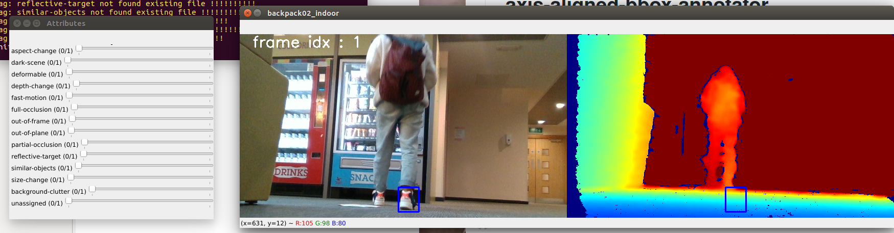

# axis-aligned-bbox-annotator
For 2D axis-aligned bounding box annotation and tags on RGBD data. Tested on Python3.6

**Instruction**
  - Press A : previous image
  - Press D : next image
  - Press S : save 
  - Press Q : quit
  - click mouse left button, drop it, release it, to draw the box 

